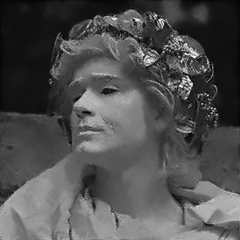

# Image Denoiser (nlmeans, rust)
The non-local means denoising algorithm searches the image for similar patches that can be averaged to eliminate noise. Each pixel is reconstructed as a weighted sum of all other nearby pixels, where the weight is determined based on the similarity of their immediate neighbors. Idealy, the entire image would be searched but the search is limited to nearby pixels to increase performance.

## possible improvements
* add support for multi-threading
* add support for GPGPU (open-cl, cuda, etc.)
* reduce dimensionality of comparison window with fourier transform

## installing
1) clone `git clone https://github.com/ajzat34/nlmeans.git`
2) run `cargo install`

## usage
see `run.bat` or [building](#building)

| option                                | description          | default      |
|---------------------------------------|----------------------|--------------|
| `-h`, `--help`                        | print help info      |              |
| `-i`, `--input`                       | input file           |              |
| `-o`, `--output`                      | output file          |              |
| `-p`, `--patch-size <SIZE>`           | sample patch radius  | `2`          |
| `-s`, `--search-size <SIZE>`          | search area radius   | `8`          |
| `-f`, `--filtering-parameter <VALUE>` | filtering amount     | `20`         |

## building
see `build.bat`
1) run `cargo build --release`
2) see `target/release/nleans.exe`
